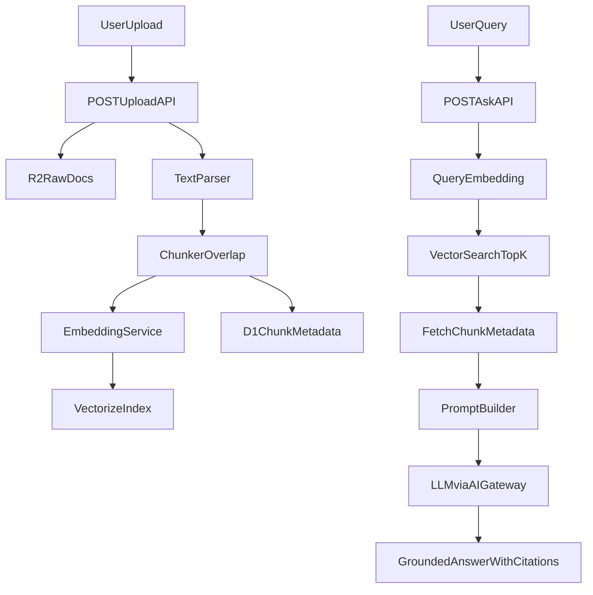

# Cloudflare RAG MVP

This document captures the approved plan for the Cloudflare-first RAG chatbot MVP and translates it into project documentation for ongoing development.

## Goal

Ship a deployable MVP that can:

- ingest documents,
- index chunk embeddings into a vector store,
- answer grounded questions using retrieved context,
- and provide a path toward streaming, auth, and multi-tenancy hardening.

The intent is to keep the first release production-minded but minimal, then iterate on reliability and product depth.

## Architecture

## Stack Mapping

| Layer | Service |
| --- | --- |
| API server | Cloudflare Workers + Hono |
| Raw document storage | R2 |
| Metadata storage | D1 |
| Vector search | Vectorize |
| LLM provider access | OpenAI through AI Gateway |
| Embeddings | OpenAI embeddings |
| Optional cache | Workers KV |

## System Flow

### Ingestion flow

1. A user uploads a `.txt` or `.md` document.
2. The raw file is stored in R2.
3. Text is extracted and chunked with overlap.
4. Each chunk is embedded.
5. Vectors are upserted into Vectorize.
6. Document and chunk metadata are saved in D1.

### Retrieval flow

1. A user submits a query to `POST /ask`.
2. The query is embedded.
3. Vectorize returns the nearest chunks.
4. D1 hydrates chunk content and document metadata.
5. A strict grounded prompt is assembled.
6. The chat model returns an answer with citations.

## Design Principles

- Chunk quality matters more than model size.
- Retrieval must be workspace-aware for data isolation.
- Prompts should explicitly forbid hallucination and require context grounding.
- Streaming improves UX, but safe fallback behavior matters more than token-by-token delivery.
- Secrets should live in Wrangler secrets or local dev secret files, not in source-controlled config.

## Phase Plan

## Phase 1: Worker Foundation

- Scaffold a Worker project with Hono and TypeScript.
- Define bindings in `wrangler.jsonc` for R2, D1, and Vectorize.
- Create the app entrypoint in `src/index.ts`.
- Add Worker env typing in `src/types/env.ts`.

## Phase 2: Data Model and Storage Contracts

- Create the D1 schema in `migrations/0001_init.sql`.
- Add a `documents` table for uploaded files.
- Add a `chunks` table for chunk records and vector references.
- Add a repository layer in `src/repositories/`.
- Standardize Vectorize metadata with:
  - `workspace_id`
  - `document_id`
  - `chunk_id`

## Phase 3: Ingestion Pipeline

- Implement `POST /upload` in `src/routes/upload.ts`.
- Support `.txt` and `.md` in the MVP.
- Chunk documents using a `300-800` token target with `~50` overlap.
- Persist raw docs to R2.
- Persist vectors to Vectorize.
- Persist metadata to D1.

## Phase 4: Retrieval and Answering

- Implement `POST /ask` in `src/routes/ask.ts`.
- Embed each query.
- Search Vectorize with `topK=5` by default.
- Hydrate matching chunks from D1.
- Build a strict grounded prompt.
- Return:
  - `answer`
  - `citations`
  - retrieval metadata

## Phase 5: Streaming and Guardrails

- Add optional streaming responses using `ReadableStream`.
- Add a no-context fallback response.
- Enforce file and query size limits.
- Add retry and backoff around provider calls.
- Emit request IDs and structured logs for debugging.

## Phase 6: Multi-tenancy and Auth

- Require `workspace_id` for ingestion and retrieval.
- Store workspace metadata in D1 and Vectorize.
- Enforce workspace scoping during retrieval.
- Add JWT middleware with room to swap in a managed auth provider later.

## Validation Strategy

The MVP should be validated with:

- local development via `wrangler dev`,
- upload checks against R2, D1, and Vectorize,
- grounded-answer checks using known source documents,
- no-context behavior for unrelated questions,
- unit tests for chunking and prompt assembly,
- route-level tests with mocked providers.

## Initial Deliverable

The first complete milestone should include:

- Worker scaffold and bindings
- D1 migration and repositories
- `POST /upload` for `.txt` and `.md`
- `POST /ask` with citations
- a setup and deployment runbook in `README.md`

## Current Repo Mapping

The implementation described by this plan maps to these key files:

- `src/index.ts`
- `src/routes/upload.ts`
- `src/routes/ask.ts`
- `src/services/chunking.ts`
- `src/services/embeddings.ts`
- `src/services/llm.ts`
- `src/services/vectorize.ts`
- `src/repositories/ragRepository.ts`
- `migrations/0001_init.sql`

## Notes for Future Iteration

Natural next steps after the MVP:

- PDF ingestion support
- async ingestion with Queues
- hybrid retrieval
- reranking
- role-based access controls
- richer UI for document management and chat history
